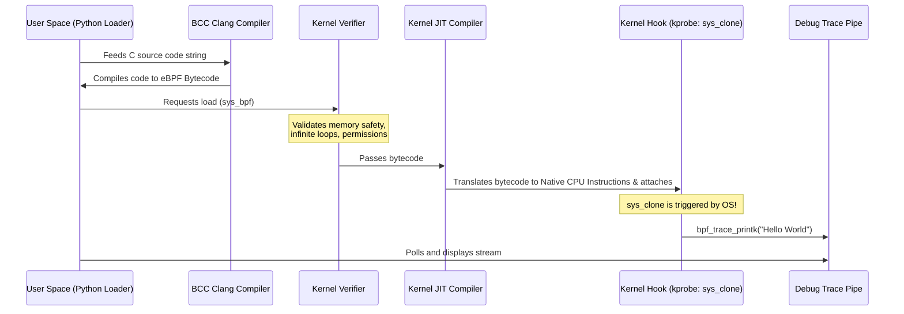

# Lesson 1: Hello World 👋

Welcome to your first hands-on eBPF program! In this lesson, we will attach an eBPF program to a **kernel dynamic probe (kprobe)**. Whenever a new process is cloned (i.e. spawned), our eBPF program will run and log a message to the system debug trace pipe.

---

## 🧠 Key Concepts

### 1. Kprobes (Kernel Probes)
A `kprobe` is a dynamic mechanism in the Linux kernel that allows you to hook into almost any arbitrary kernel function instruction. 
- When you register a kprobe, the kernel replaces the instruction at the target function's entry point with a breakpoint instruction.
- When execution hits the breakpoint, the kernel jumps to your registered handler (our eBPF function).
- Once your handler finishes, execution resumes as normal.
- **Why dynamic?** Because you can hook into functions without recompiling or rebooting the kernel.

In this lesson, we will probe `__x64_sys_clone` (or simply `sys_clone` via BCC's abstraction layer), which is the system call invoked when a new thread or process is created (e.g. by running a command, opening a subshell, or fork-execing).

---

### 2. eBPF Execution Flow
This is the life cycle of our program:



---

### 3. Debug Trace Pipe (`bpf_trace_printk`)
The function `bpf_trace_printk()` is a helper function built into the kernel that writes formatted strings to the global debug trace buffer: `/sys/kernel/debug/tracing/trace_pipe`.

> [!WARNING]
> **Why `bpf_trace_printk` is for Debugging Only:**
> 1. **Global Contention**: The trace pipe is shared system-wide. Every eBPF program using it writes to the *same* buffer. Heavy usage will cause lines to drop and corrupt output.
> 2. **Slow Performance**: Writing strings inside the hot path of the kernel has significant overhead (string copying, locking).
> 3. **Format Limitations**: You can pass a maximum of three arguments, and formatting is rudimentary.
> 
> In Lesson 3 & 5, we will learn the production way to pass data (Maps and Ring Buffers).

---

## 💻 Code Walkthrough

### Kernel C Code
```c
int hello(void *ctx) {
    bpf_trace_printk("Hello World! A new process is spawning!\\n");
    return 0;
}
```
- **`hello` function**: The name of our eBPF handler.
- **`void *ctx`**: The context pointer. This contains CPU registers and calling state. We don't use it yet (we will in Lesson 2).
- **`bpf_trace_printk()`**: Writes to the trace pipe.
- **`return 0`**: Standard return code. Returning a non-zero value can have implications depending on the hook type (for kprobes it is ignored, but we always return 0 to satisfy the verifier).

### User Python Loader
```python
from bcc import BPF

# 1. Compile and Load BPF program
b = BPF(text=program_code)

# 2. Attach our hello function to the sys_clone kernel entry hook
b.attach_kprobe(event=b.get_syscall_fnname("clone"), fn_name="hello")

# 3. Read and print trace output indefinitely
b.trace_print()
```
- **`BPF(text=...)`**: Invokes `bcc`, compiles the C code inline, and loads the bytecode.
- **`b.get_syscall_fnname("clone")`**: Translates system call name to the actual architecture-specific kernel function name (e.g., `__x64_sys_clone`).
- **`b.attach_kprobe(...)`**: Instructs the kernel to attach our BPF handler.
- **`b.trace_print()`**: Standard helper to poll and stream `/sys/kernel/debug/tracing/trace_pipe` directly to the terminal.

---

## 🏃 Running the Script

On your Linux VM:

```bash
# Must run as root (sudo) to load programs into the kernel!
sudo python3 hello.py
```

While running, open another terminal or run commands (e.g. `ls`, `curl`, etc.) to trigger new process clones. You should see messages like:
```text
      bpf_helper-345388 [000] d... 12845.856983: bpf_trace_printk: Hello World! A new process is spawning!
```
*(Press `Ctrl+C` to terminate the program).*
