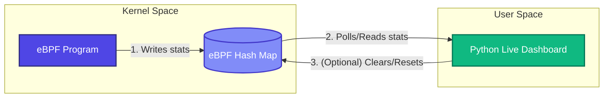

# Lesson 3: eBPF Maps (Hash Maps) 📊

In previous lessons, we used `bpf_trace_printk()` to dump raw text logs. In production, this approach is extremely slow and inefficient. To build real-time monitoring tools, we need a high-performance way to share structured state between kernel-space and user-space. This is done using **eBPF Maps**.

---

## 🧠 Key Concepts

### 1. What are eBPF Maps?
eBPF Maps are high-performance key-value stores implemented in kernel space. They are the universal mechanism for:
1. **Sharing state** between different eBPF programs (e.g. tracking state between a syscall start and finish).
2. **Exposing data** to user-space tools (e.g. sharing telemetry, logs, or metrics).
3. **Configuring** eBPF programs from user-space (e.g. passing IP blocklists or config parameters).



---

### 2. Map Type: Hash Map (`BPF_HASH`)
The Linux kernel offers many different map types (Array, Hash, Ring Buffer, LRU Hash, Stack, Trie, etc.). 
- **`BPF_HASH`** is a dynamic hash table. It allocates memory on demand, which is perfect for keeping statistics on arbitrary, sparse keys (like PIDs, IP addresses, or filenames).

In C, BCC simplifies map declaration with macros:
```c
// Syntax: BPF_HASH(map_name, key_type, value_type);
BPF_HASH(stats_map, u32, u64); 
```
If you omit the key and value types, BCC defaults to `u64` for both:
```c
BPF_HASH(stats_map); // equivalent to BPF_HASH(stats_map, u64, u64);
```

---

### 3. Reading and Writing Maps in Kernel Space
We can perform atomic operations on maps using built-in methods:

- **`map.lookup(&key)`**: Returns a pointer to the value associated with the key, or `NULL` if not found.
- **`map.update(&key, &value)`**: Associates a key with a value. If the key already exists, its value is updated.
- **`map.delete(&key)`**: Removes a key and its value from the map.

> [!CAUTION]
> **Pointer Safety & The Verifier:**
> When you lookup a key using `map.lookup(&key)`, the verifier **strictly requires** you to check if the returned pointer is `NULL` before dereferencing it. Failing to do a null check will trigger a verifier error and prevent the program from loading!
> 
> ```c
> u64 *value = stats_map.lookup(&key);
> if (value == NULL) {
>     // MUST HANDLE THIS PATH
> }
> ```

---

## 💻 Code Walkthrough

In this lesson, we will hook `sys_write` (the system call invoked whenever processes write data to files, terminal output, sockets, etc.). 
We will count how many times each PID invokes `sys_write` and keep track of their executable names using a custom C struct:

```c
struct process_stats {
    u64 write_count;    // Number of sys_write calls
    u64 bytes_written;  // Total bytes written
    char comm[16];      // Process name
};

BPF_HASH(stats_map, u32, struct process_stats);
```

### Kernel Update Logic
```c
int count_writes(struct pt_regs *ctx, int fd, const void *buf, size_t count) {
    u32 pid = bpf_get_current_pid_tgid() >> 32;
    struct process_stats *stats = stats_map.lookup(&pid);
    
    if (stats != NULL) {
        // Key exists, increment the values
        stats->write_count++;
        stats->bytes_written += count;
    } else {
        // Key doesn't exist, initialize and insert it
        struct process_stats new_stats = {
            .write_count = 1,
            .bytes_written = count
        };
        bpf_get_current_comm(&new_stats.comm, sizeof(new_stats.comm));
        stats_map.update(&pid, &new_stats);
    }
    return 0;
}
```

---

## 🏃 Running the Script

On your Linux VM:

```bash
sudo python3 syscall_counter.py
```

The script will clear your terminal and draw a **beautiful live-updating dashboard** showing:
- Active Process PIDs
- Process Names
- Total `sys_write` occurrences
- Total Megabytes (or Kilobytes) written!

```text
============================================================
              eBPF LIVE WRITE TELEMETRY DASHBOARD
============================================================
 PID          PROCESS          WRITE CALLS      BYTES WRITTEN
------------------------------------------------------------
 48329        node             1,248            4.12 MB
 49201        python3          382              28.45 KB
 1284         dockerd          94               112.90 KB
 832          systemd-journal  12               1.20 KB
============================================================
```

Press `Ctrl+C` to stop. When stopping, the script prints a final sorted summary of all processes.

Let's move on to **[Lesson 4: Stable Interfaces - Tracepoints](file:///Users/vinit/.gemini/antigravity/worktrees/ebpf/ebpf-teaching-scripts-demo/04_tracepoints)** to see how we hook stable system boundaries!
