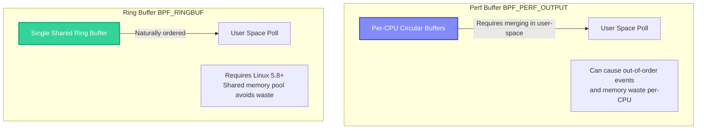

# Lesson 5: High-Performance Event Rings (Perf Buffers) 🏎️

In this lesson, we will build a production-grade **Process Auditor** that measures the exact execution duration of processes by correlating their start and exit events. To transmit these high-frequency events to user-space without lagging the system, we will use **Perf Event Ring Buffers** (`BPF_PERF_OUTPUT`).

---

## 🧠 Key Concepts

### 1. The Event Streaming Dilemma
So far, we have seen three ways to share data between the kernel and user-space. Let's compare their performance traits:

| Mechanism | Speed | CPU Overhead | Use Case |
| :--- | :--- | :--- | :--- |
| **`bpf_trace_printk` (Trace Pipe)** | 🔴 **Slow**. Global lock, format strings evaluated inside kernel. | 🔴 **High** | Ad-hoc debugging only. |
| **Map Polling (`BPF_HASH` etc.)** | 🟡 **Medium**. Great for aggregated statistics (counters, gauges), but poor for high-frequency individual events due to polling latency. | 🟡 **Medium** | Aggregated telemetry (Lesson 3). |
| **Perf / Ring Buffers** | 🟢 **Fast**. Lockless, memory-mapped shared circular ring buffers. Zero-copy potential. | 🟢 **Low** | Streaming individual high-frequency events (e.g. syscall monitoring, packet capturing). |

---

### 2. Perf Buffer vs. Modern Ring Buffer
In the Linux eBPF ecosystem, there are two primary event buffer implementations:



1. **Perf Buffer (`BPF_PERF_OUTPUT`)** (Classic):
   - Allocates a separate circular ring buffer **for each CPU**.
   - **Pros**: Outstanding write performance (lockless write per-CPU). Works on older kernels.
   - **Cons**: User space must read from multiple buffers, which can cause events to arrive **out of order**. If a buffer on one CPU fills up, events are dropped, even if buffers on other CPUs are completely empty.

2. **Ring Buffer (`BPF_RINGBUF`)** (Modern - Linux 5.8+):
   - A single, global circular buffer shared across **all CPUs**.
   - **Pros**: Memory efficient (no per-CPU pre-allocations). Guarantees **strict order of arrival**. Solves memory fragmentation.
   - **Cons**: Requires a modern kernel (5.8 or higher).

*Note: For maximum compatibility across target teaching VMs, we will implement the widely-supported `BPF_PERF_OUTPUT`.*

---

### 3. State Correlation: Start to Finish
Processes start via `execve` and end when they exit. How do we measure execution time?
1. On process execution (`sys_enter_execve`), we record the current timestamp (`bpf_ktime_get_ns()`) inside a `BPF_HASH` map, keyed by the PID.
2. On process exit (`sched_process_exit` tracepoint), we look up the start time in our map.
3. We compute the difference: `duration_ns = current_timestamp - start_timestamp`.
4. We clean up the map entry (`stats.delete(&pid)`) to prevent memory leaks!
5. We pack the duration, PID, PPID, process name, and exit code into a custom struct and push it to the Perf Buffer.

---

## 💻 Code Walkthrough

### C Custom Event Struct
```c
struct process_event {
    u32 pid;
    u32 ppid;
    u64 duration_ns;
    char comm[16];
    int exit_code;
};
BPF_PERF_OUTPUT(events); // Declare the Perf Buffer
```

### Sending Events in Exit Hook
```c
TRACEPOINT_PROBE(sched, sched_process_exit) {
    u64 pid_tgid = bpf_get_current_pid_tgid();
    u32 pid = pid_tgid >> 32;
    
    // 1. Lookup start time
    u64 *start_ns = start_times.lookup(&pid);
    if (start_ns == NULL) return 0; // Not tracked
    
    // 2. Compute duration
    u64 duration_ns = bpf_ktime_get_ns() - *start_ns;
    
    // 3. Populate struct
    struct process_event event = {
        .pid = pid,
        .duration_ns = duration_ns
    };
    
    // Get parent PID and command name from kernel task struct
    struct task_struct *task = (struct task_struct *)bpf_get_current_task();
    event.ppid = task->real_parent->tgid;
    bpf_get_current_comm(&event.comm, sizeof(event.comm));
    
    // Extract exit code
    event.exit_code = task->exit_code >> 8; 
    
    // 4. Send event to user-space
    events.perf_submit(args, &event, sizeof(event));
    
    // 5. Clean up map to avoid leaks
    start_times.delete(&pid);
    return 0;
}
```

---

## 🏃 Running the Script

On your Linux VM:

```bash
sudo python3 process_monitor.py
```

Run short commands in another shell (e.g. `ls`, `sleep 0.5`, `cat /etc/passwd`).
The script outputs beautiful real-time execution logs with **exact process durations**:

```text
========================================================================================
                      PROCESS LIFECYCLE AUDITOR (PERF RING STREAM)
========================================================================================
 TIME     PID      PPID     DURATION     EXIT   COMMAND
----------------------------------------------------------------------------------------
 09:21:40 348231   348102   12.45 ms     0      ls
 09:21:42 348235   348102   504.12 ms    0      sleep 0.5
 09:21:45 348240   348102   4.10 ms      1      nonexistent_cmd
========================================================================================
```

Let's proceed to the final lesson: **[Lesson 6: User-Space Tracing - Uprobes](file:///Users/vinit/.gemini/antigravity/worktrees/ebpf/ebpf-teaching-scripts-demo/06_uprobes)** to trace applications!
