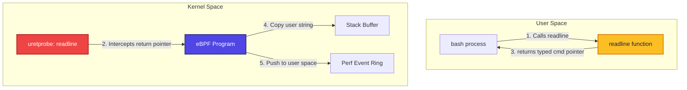

# Lesson 6: User-Space Tracing (Uprobes & Uretprobes) 🕵️‍♂️

So far, we have only traced kernel-space events (system calls and scheduler exits). In this final lesson, we will move outside the kernel and dynamically instrument applications running in **user-space** using **Uprobes** and **Uretprobes**. We will build an auditor that captures every keystroke/command entered in a `/bin/bash` shell session!

---

## 🧠 Key Concepts

### 1. What are Uprobes and Uretprobes?
Just as kprobes and kretprobes instrument the Linux kernel, **Uprobes** and **Uretprobes** allow you to hook into arbitrary user-space binaries (like executable programs or shared libraries) without modifying the binary on disk or restarting the process.



- **Uprobes**: Hooks function entry. Triggered when a user-space function starts executing.
- **Uretprobes**: Hooks function exit/return. Triggered when a user-space function returns. Allows reading the return value.

---

### 2. How Uprobes Work Internally
When you register a uprobe, the kernel performs the following steps:
1. Copies the target user-space instruction at the target offset.
2. Overwrites the target instruction in memory with a CPU-specific breakpoint instruction (e.g. `int3` on x86_64).
3. When the application execution hits the breakpoint, the CPU traps to the kernel.
4. The kernel switches execution context, executes your eBPF program, and then returns control to the user application, executing the original copied instruction.

> [!WARNING]
> **Performance Overhead:**
> Because uprobes require double context-switching (User Space -> Kernel Space for eBPF -> User Space to resume), they have higher overhead than kernel-space kprobes. Hooking extremely fast user-space functions in high-frequency loops should be done with caution.

---

### 3. Hooking Bash Command Input
To intercept what a user types into a shell, we hook into the function `readline()`.
- `readline()` is standard in `/bin/bash` and other CLI tools. It prompts the user for input, waits for keystrokes, and returns a char pointer (`char *`) pointing to the null-terminated string typed by the user when they press Enter.
- By placing a **uretprobe** on `readline()`, we can catch the function *just as it returns*.
- In a return probe, the CPU register storing the return value is accessed using the macro `PT_REGS_RC(ctx)`. This holds the user-space address of the typed command string.
- We then use `bpf_probe_read_user_str()` to read that string.

---

## 💻 Code Walkthrough

### Kernel C Code
```c
#include <linux/ptrace.h>

BPF_PERF_OUTPUT(events);

int capture_input(struct pt_regs *ctx) {
    // PT_REGS_RC(ctx) extracts the return value (the address of the typed command string)
    char *user_ptr = (char *)PT_REGS_RC(ctx);
    if (user_ptr == NULL) return 0;
    
    char command[128];
    // Safely copy string from user-space address space
    long res = bpf_probe_read_user_str(&command, sizeof(command), user_ptr);
    
    if (res >= 0) {
        // Send command string to user-space
        events.perf_submit(ctx, &command, sizeof(command));
    }
    return 0;
}
```

### User Python Loader
```python
b = BPF(text=bpf_program)

# Attach uretprobe to the "/bin/bash" binary, symbol "readline"
b.attach_uretprobe(name="/bin/bash", sym="readline", fn_name="capture_input")
```

---

## 🏃 Running the Script

On your Linux VM:

```bash
sudo python3 bash_readline.py
```

Now, open another shell terminal and type standard bash commands (e.g. `echo hello`, `ls -la`, `exit`).
Your monitoring script will intercept **every single command typed** in real-time!

```text
========================================================================
              eBPF USER-SPACE BASH KEYSTROKE AUDITOR
========================================================================
 [AUDIT] Command typed on CPU 0: ls -la
 [AUDIT] Command typed on CPU 1: cat /etc/resolv.conf
 [AUDIT] Command typed on CPU 0: echo "hacked!"
========================================================================
```

---

## 🎓 Curriculum Wrap-Up
Congratulations! You have completed the **Progressive eBPF Curriculum**. You have mastered:
1. **BPF Architecture & Boilerplate** (Lesson 1)
2. **Telemetry extraction using helpers** (Lesson 2)
3. **Structured state with Maps** (Lesson 3)
4. **Stable ABI hooks with Tracepoints** (Lesson 4)
5. **High-speed async Event Rings** (Lesson 5)
6. **Dynamic user-space dynamic instrumentation** (Lesson 6)

For instructions on deploying and verifying all scripts inside a Linux VM, check the root **[README.md](file:///Users/vinit/.gemini/antigravity/worktrees/ebpf/ebpf-teaching-scripts-demo/README.md)** and the **[VERIFICATION.md](file:///Users/vinit/.gemini/antigravity/worktrees/ebpf/ebpf-teaching-scripts-demo/VERIFICATION.md)** guide!
