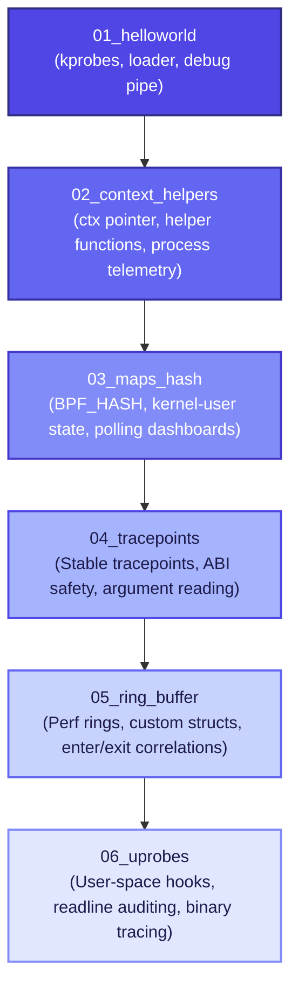

# Progressive eBPF Teaching Curriculum 🚀

Welcome to the **Progressive eBPF Teaching Curriculum**! This repository is designed to take you from an absolute beginner with no kernel experience to building high-performance, production-grade eBPF tools.

eBPF (Extended Berkeley Packet Filter) is a revolutionary technology that allows you to run sandboxed programs inside the Linux kernel without changing kernel source code or loading kernel modules. Think of it as **JavaScript for the Kernel**—making the kernel dynamically programmable!

---

## 🗺️ Curriculum Path

Each lesson in this repository introduces key eBPF concepts and progressively builds on the previous one. We use the **BPF Compiler Collection (BCC)** framework, combining simple, fast-to-develop Python scripts for the user-space loader and high-performance C fragments for the kernel-space filters.



---

## 📖 Lesson Index

| Lesson | Folder | Primary Concepts Covered | Practical Outcome |
| :--- | :--- | :--- | :--- |
| **1** | [`01_helloworld`](file:///Users/vinit/.gemini/antigravity/worktrees/ebpf/ebpf-teaching-scripts-demo/01_helloworld) | BCC loader boilerplate, kernel `kprobes`, trace pipe, kernel-user isolation | Print "Hello World" on every new process spawn. |
| **2** | [`02_context_helpers`](file:///Users/vinit/.gemini/antigravity/worktrees/ebpf/ebpf-teaching-scripts-demo/02_context_helpers) | Kernel context `ctx` pointers, helper functions, process ID logic, UID auditing | Inspect PID, parent TGID, user ID, and executable name. |
| **3** | [`03_maps_hash`](file:///Users/vinit/.gemini/antigravity/worktrees/ebpf/ebpf-teaching-scripts-demo/03_maps_hash) | eBPF Hash Maps (`BPF_HASH`), atomic helpers, polling maps from Python | Real-time CLI terminal dashboard counting systems calls. |
| **4** | [`04_tracepoints`](file:///Users/vinit/.gemini/antigravity/worktrees/ebpf/ebpf-teaching-scripts-demo/04_tracepoints) | Kernel stable tracepoints vs dynamic kprobes, ABI structure inspection | Audit executed filenames safely across kernel upgrades. |
| **5** | [`05_ring_buffer`](file:///Users/vinit/.gemini/antigravity/worktrees/ebpf/ebpf-teaching-scripts-demo/05_ring_buffer) | Perf event buffers (`BPF_PERF_OUTPUT`), custom C structs, lifecycle timing correlation | Production-grade `execsnoop` showing process lifetimes. |
| **6** | [`06_uprobes`](file:///Users/vinit/.gemini/antigravity/worktrees/ebpf/ebpf-teaching-scripts-demo/06_uprobes) | Dynamic user-space probes (`uprobes`/`uretprobes`), parsing libraries | Keystroke auditor capturing commands typed into any `/bin/bash`. |

---

## 🛠️ VM Setup & Environment

eBPF is tightly bound to the Linux kernel. If you are developing on macOS or Windows, you will need a Linux Virtual Machine (VM) or a remote Linux host (Ubuntu 20.04+ recommended) with root/sudo privileges.

### 1. Install Dependencies on your Linux VM

SSH into your target Linux system and install the required tools:

```bash
# Update package repositories
sudo apt-get update

# Install BPF Compiler Collection (BCC) and kernel headers
sudo apt-get install -y python3-bpfcc bpfcc-tools linux-headers-$(uname -r) clang llvm

# (Optional) Install helper tools for compiling and debugging
sudo apt-get install -y strace stress-ng
```

### 2. Verify Your Environment

To ensure your kernel supports the BPF features needed, verify that the `/sys/kernel/debug/tracing` directory is mounted:

```bash
mount | grep debugfs
```
*(If it returns empty, run `sudo mount -t debugfs debugfs /sys/kernel/debug`)*

---

## 🎓 Design Principles of this Curriculum

1. **Self-Documenting Code**: Every line of kernel C and user Python is exhaustively commented, explaining *why* we do things, *what* safety checks the kernel verifier expects, and *how* the runtime compiles the code.
2. **Interactive Terminal UIs**: The user-space Python loader scripts aren't just dry printouts. They feature elegant ANSI formatting, interactive loaders, and auto-updating dashboard UIs.
3. **Progressive Architecture**: We avoid repeating concepts. Once you learn about `bpf_get_current_comm()`, we focus on map logic or perf rings, rather than re-explaining process context.

---

## 🚀 Let's Get Started!

Move to **[Lesson 1: Hello World](file:///Users/vinit/.gemini/antigravity/worktrees/ebpf/ebpf-teaching-scripts-demo/01_helloworld)** to load your first eBPF bytecode instructions into the kernel!
